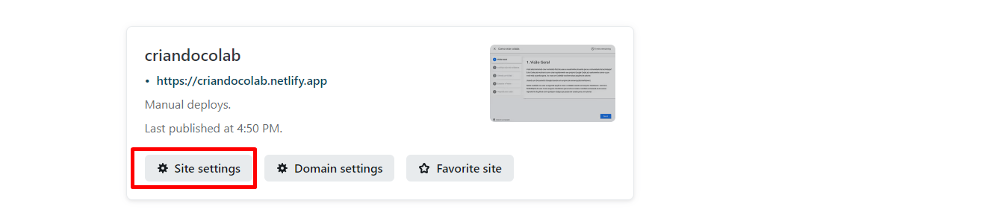

author: Rogério Siqueira de Miranda
summary: Como construir um colab
id: 1
categories: codelab, markdown
environments: Web
status: Published
feedback link: https://github.com/rogercomp
analytics account: Google Analytics ID

# Como criar colabs

## Visão Geral
Duration: 0:05:00

Você está tentando criar conteúdo fácil de usar e visualmente atraente para a comunidade de tecnologia? Este CodeLab mostrará como criar rapidamente seu próprio Google CodeLab, exatamente como o que você está 
usando agora. Ao criar um Codelab você tem duas opções de autoria:

Usando um Documento Google
Usando um arquivo de remarcação(markdown)

Neste codelab vou usar a segunda opção e criar o codelab usando um arquivo markdown. Isso dá a flexibilidade de usar nosso arquivo markdown para outras coisas e também armazená-lo em nosso repositório 
do github com qualquer código que possa ser usado para um tutorial.

## Configuração do Ambiente

Para criar um CodeLab, você precisa do Go e do claat (a ferramenta de linha de comando do codelabs) instalados.

As instruções abaixo são o que funcionou para mim no Windows:

* [GO](https://go.dev/dl/)

Após a instalação do GO abra um cmd e digite: go version

caso ele traga as informações da versão instalada siga o passo abaixo

* Claat => Dentro do CLI do GO digite: go install github.com/googlecodelabs/tools/claat@latest

## Criando um Colab

Usando um editor de markdown de sua preferência, edite o texto conforme deseje:

 ### Header Metadata 
    
	Os metadados consistem em pares de valores-chave no formato "chave: valor"  
    
    author  -  Nome do autor do colab
    summary -  Um resumo legível do codelab. O padrão é em branco.
	id - Um identificador composto por letras minúsculas que descrevem idealmente 
	     o conteúdo do codelab. Este campo deve ser único entre codelabs.
	categories - Uma lista separada por vírgulas dos tópicos abordados pelo codelab.
	environments - Uma lista de ambientes nos quais o codelab deve ser descoberto. 
	               Os codelabs marcados como "Web" ficarão visíveis no índice de 
				   codelabs. Codelabs marcados "Kiosk" estará disponível apenas 
				   nos quiosques da codelabs, que possuem equipamento anexado.
    status - O status de publicação do codelab. Os valores válidos são:
             Draft: Codelab não está concluído.
             Published: Codelab finalizado e visível.
             Deprecated: o Codelab é considerado obsoleto e não deve ser 
			             amplamente divulgado. 
             Hidden: Codelab não é mostrado no índice.	
	Feedback Link - Um link para enviar aos usuários se quiserem deixar 
	                comentários sobre o codelab.
    Analytics Account: um ID do Google Analytics para incluir em todas 
	                   as páginas do codelab

 ### Adicionando Título     

	Para adicionar um título use o caracter '#'	

 ### Adicionando Seção e Duration
    
    Em seguida, para cada section, use o Header 2 ou '##' e especifique uma duração 
	opcional abaixo para cálculos de tempo restante. Os tempos de section opcionais 
	serão usados para totalizar automaticamente e os tempos restantes do tutorial
    No markdown, a hora está formatada hh:mm:ss	   
	
## Exportar e Testar
   
   Abra um cmd e execute as instruções abaixo:
   
 * claat export nomecodelab.md
 * claat serve
	  
## Resumo Markdown

   #### Ênfase
      
	  Para adicionar ênfase ao contéudo a ser escrito usa-se:
	  
	  * Negrito: adicione 2 asteriscos **texto** ou 2 traços baixos __texto__	  
	  
      * Itálico: adicione apenas um asterisco *texto* um traço baixo _texto_
	  
	  Para adicionar lista de itens usa-se:
	  
	  * Não ordenadas: utilize um asterisco com espaço na frente do item
	    * item 1
		* item 2
		* item 3
		
	  * Lista ordenada: utilize o número do item seguindo do ponto(.)
	    1. item 1
		2. item 2
		3. item 3
		
	  Para adicionar imagens usa-se:
	  
	  * 
	  
	  Para adicionar citação usa-se:
	  
	  * Utilize o sinal > no início da linha que será formatada
	  
	  Para adionar tabela usa-se:
	  
	  * Escolha os titulos das colunas e use | para delimitação, depois 
	    utilize o hífen na segunda linha para indicar que acima estãos os titulos
		novamente o hifen para delimitação
		### Exemplo
		
		Exemplo | Valor
		-----------------
		Ex 1    | R$ 10
		Ex 2    | R$ 12
		Ex 3    | R$ 5 
	  
## Hospede seu colab
   
   Servidor utilizado: [Netlify](https://app.netlify.com)

   1. Cria uma conta na Netlify para publicação

   2. Procure a opção **Add new site** 
    
	
   3. Depois selecione a opção **Deploy manually**
    	
	
   4. Na opção **browse to upload** aponte para a pasta do colab construído
    
	
   5. Espere terminar o upload, caso queira mude o nome do site na opção
      Site Settings > Change Site Name e coloque o nome do site    
	  
	  	  
	  
  	  